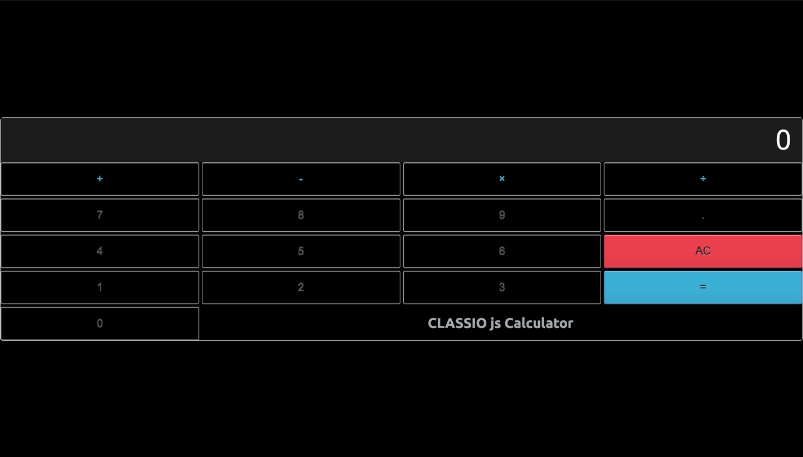

### The Odin Project 

---

## Javascript calculator 

## Live Demo

https://webdevbrum.github.io/ODIN-Calculator-App/

---

## About 

This calculator was built after briefly working through the initial ODIN project curriculum, it actually turned out not to be as simple to build as expected, though it was quite exciting when it actually worked.

---

## Getting Started

No pre requisite installation required, built using Vanilla JavaScript.